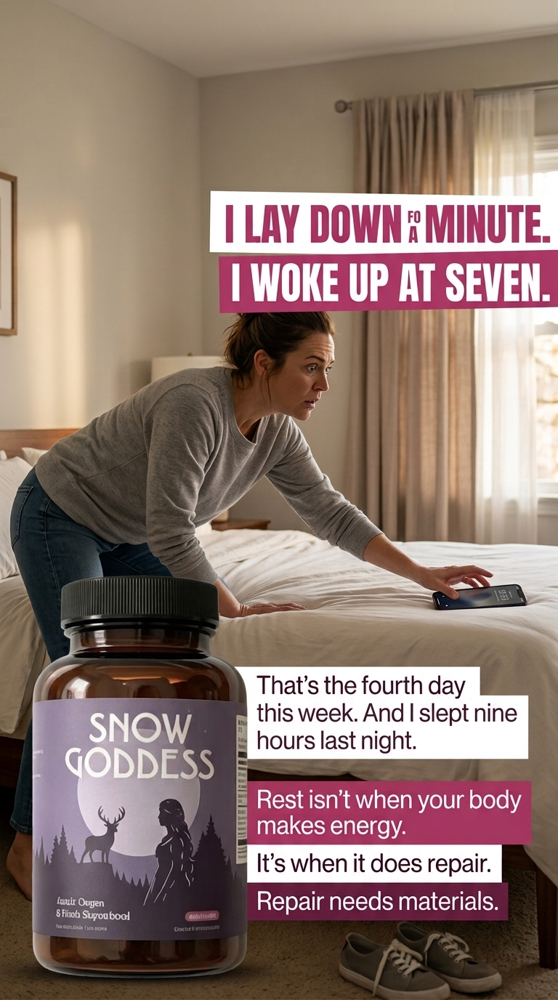
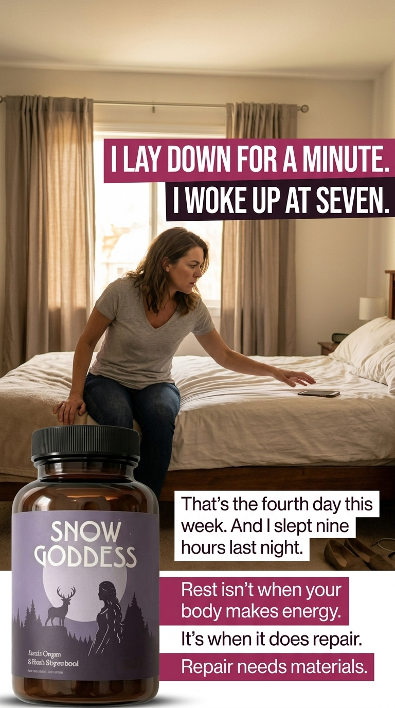
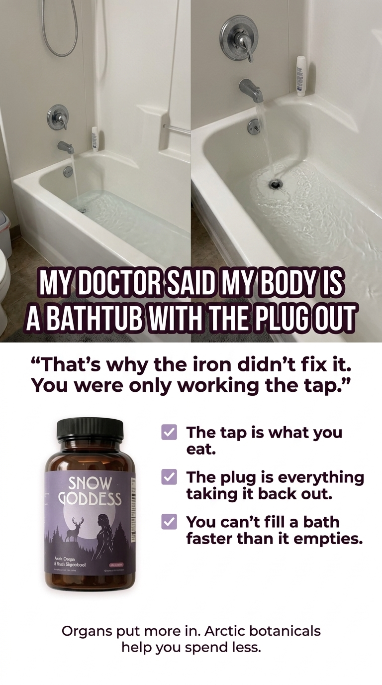
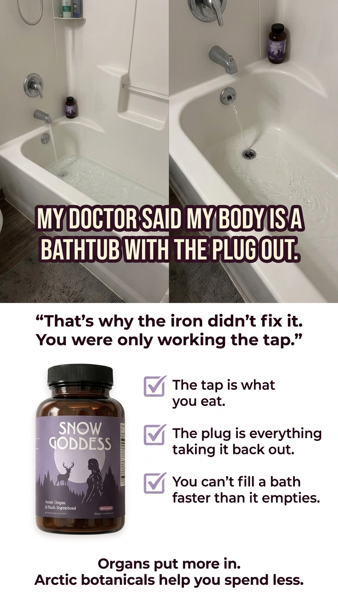
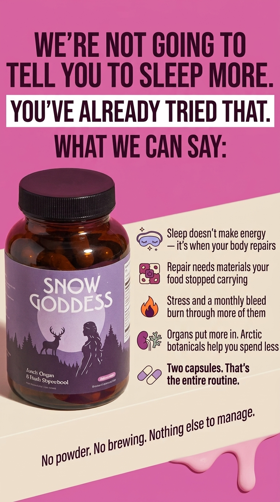
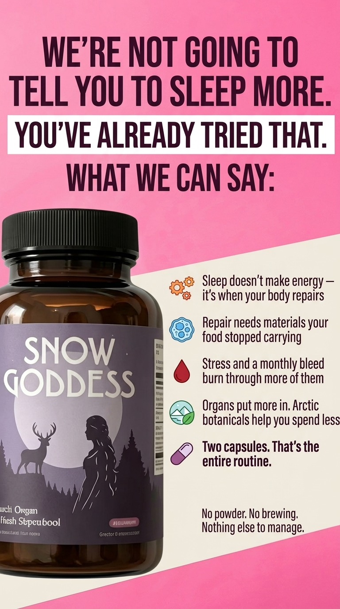

# Snow Goddess — Concept 3

Six strict-reference static-ad outcomes for the Snow Goddess fatigue campaign.

- Format: 1080 × 1920, 9:16
- Model: Nano Banana 2
- Resolution: 1K
- Variations: two per concept
- Feed rule: all essential information is intended to survive a centered 4:5 crop without displaying a visible safe-zone card.

## Recommended selections

1. **3.1 The Confession:** `3.1-confession-v2.png`
2. **3.2 The Bathtub:** `3.2-bathtub-v1.png`
3. **3.3 The Refusal:** `3.3-refusal-v2.png`

## 3.1 — The Confession

Source composition: [`Happy Mammoth 07`](../../trendtrack/statics/07-happy-mammoth-facebook-934252822745880.jpg)

Note: v2 is preferred. v1 has a headline rendering defect.

## 3.2 — The Bathtub

Source composition: [`RYZE 14`](../../trendtrack/statics/14-ryze-superfoods-facebook-1465090648528558.jpg)

Note: v1 is preferred. v2 introduced unwanted miniature bottles inside the bathtub photographs.

## 3.3 — The Refusal

Source composition: [`Happy Mammoth 09`](../../trendtrack/statics/09-happy-mammoth-facebook-808179408705482.jpg)

Note: v2 is preferred, although both are usable for visual-direction discussion.
